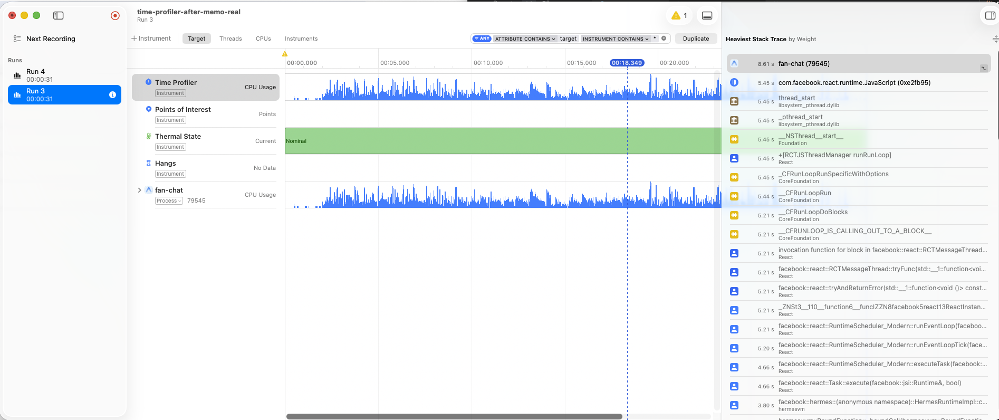
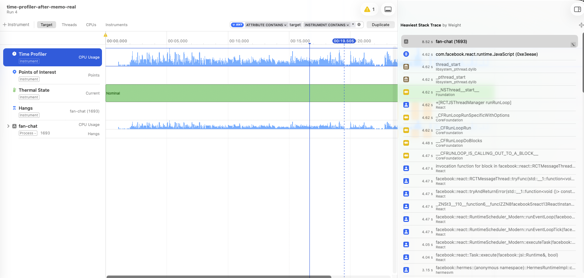

# fan-chat

## Contents

- [Platform tested](#platform-tested)
- [Requirements](#requirements)
- [Install](#install)
- [Run the project](#run-the-project)
- [Other commands](#other-commands)
- [Architecture](#architecture)
- [Demo controls](#demo-controls)
- [Technical implementation notes](#technical-implementation-notes)
- [Resuming a large media upload](#resuming-a-large-media-upload)
- [App Store / Google Play rules](#app-store--google-play-rules-relevant-to-creator-content-and-payments)
- [Performance](#performance-profiling-the-50k-message-conversation)
- [Time spent](#time-spent)
- [Known limitations / not yet done](#known-limitations--not-yet-done)

## Platform tested

Tested on **iOS Simulator — iPhone 18 Pro, iOS 27.0**. Android was not
tested during this exercise (no Android emulator was set up in this
environment); the app doesn't use any iOS-only native module, so it
should run on `pnpm android` unmodified, but that path is unverified.

## Requirements

- Node.js
- pnpm
- Xcode (for the iOS simulator) or Android Studio (for the Android emulator)

## Install

```bash
pnpm install
```

## Run the project

```bash
pnpm start
```

This opens the Metro bundler with Expo Dev Tools. From there you can pick a platform, or run directly:

```bash
pnpm ios      # opens the iOS simulator (requires Xcode installed)
pnpm android  # opens the Android emulator (requires Android Studio installed)
pnpm web      # opens in the browser
```

### iOS simulator, step by step

1. Install Xcode from the App Store (it includes the iOS simulator).
2. Open Xcode once and accept the license / install any "Additional Components" it asks for.
3. Run `pnpm ios` — Expo builds the app and opens the simulator automatically.

If the simulator doesn't open on its own, launch it manually from `Xcode > Open Developer Tool > Simulator`, then run `pnpm ios` with the simulator already open.

### Physical device (Expo Go)

1. Install the **Expo Go** app from the App Store or Play Store.
2. Run `pnpm start`.
3. Scan the QR code shown in the terminal/Dev Tools with your camera (iOS) or from the Expo Go app (Android).

## Other commands

```bash
pnpm lint       # ESLint
pnpm typecheck  # tsc --noEmit
pnpm test       # Jest
```

## Architecture

For a more visual, easier-to-follow review, see the whole architecture here: https://claude.ai/artifact/2P2MKsg49pMUmZPbVY9Cf1

### Features implemented

- **Chat**
  - Send a text message, with optimistic UI (Pending → Sent → Confirmed
    delivery ticks, WhatsApp-style).
  - Retry a failed message from the bubble itself, without losing its
    content or position in the thread.
  - Verify a message actually reached the other side — the Confirmed
    state only lands after the mock backend's own confirmation event,
    never optimistically assumed.
  - Offline handling: an `OfflineBanner` while connectivity is down
    (a debug-only forced-offline toggle — there's no real network check),
    pending messages queue instead of failing outright, and everything
    reconciles automatically on reconnect/app-foreground.
  - Receive incoming messages from the other participant in real time
    (event-driven, no polling).
  - Scroll a 50,000-message thread with keyset pagination
    (`@shopify/flash-list`), reachable from the normal chat list.
  - Search conversations (`ConversationSearch`).
- **Gifts**
  - Send a one-off tip from inside a thread (`GiftModal`: amount, payment
    method, subtotal/fees/total).
  - Resolves instantly, with no confirmation delay — a gift is meant to
    feel immediate.
  - Drops a `GiftRow` system message into the thread once confirmed.
  - Repeated taps never duplicate a charge (idempotent per purchase).
- **Subscriptions**
  - Become a paying "Fan" of a creator (`FanPaywallModal`, a simulated
    payment sheet with Success/Cancel/Fail buttons).
  - Two-phase state: a succeeded purchase reads as `PendingConfirmation`
    until the backend separately confirms it (~1.5s delay), then flips to
    `Active` — never optimistically granted on payment alone.
  - "Restore purchase" — reactivates an existing subscription without
    creating a duplicate ledger entry.
  - `BecomeFanButton`'s label follows live status: "Become a Fan" →
    "Confirming access…" → "Fan in All Access".
- **Dark mode**
  - Follows the OS color scheme automatically (NativeWind `dark:`
    variant).
  - No manual in-app toggle — switches instantly when the OS setting
    changes, no app restart needed.
- **`ChatDebugMenu`** (always visible, every build, floating bug icon in
  a chat thread — see "Demo controls" below for the why)
  - "Go offline" / "Go back online" — forces sends to queue instead of
    reaching the backend, and reconnects/flushes the queue on toggle
    back.
  - "Drop next response" — the next send is accepted but never confirmed,
    to test retry-without-duplicate.
  - "Reject next message (non-recoverable)" — the next send is refused
    outright, no retry offered.
  - "Simulate 4 incoming messages" — pushes 4 canned messages from the
    other participant, meant to pair with "Go offline".
  - "Clear subscription access" — simulates a reinstall, so "Restore
    purchase" has something to find.
- **`DemoResetButton`** (always visible, sidebar on desktop / floating
  button on mobile) — wipes every chat/purchase/subscription table,
  resets every in-memory mock backend, and navigates back to the
  conversation list, so each recording starts from a clean, reseeded
  state.
- **Responsive desktop/mobile layout**
  - `DesktopSidebar` + multi-column view on wide screens.
  - `MobileTabBar` + full-screen view on narrow screens.
  - Switches at runtime via `useIsDesktopLayout`, not a separate build per
    platform.
  - Only actually tested on the **iOS Simulator** (see "Platform tested"
    above) — the layout logic itself is platform-agnostic, but unverified
    on Android/web.

### Layers architecture

Defined this way on purpose, to keep logic separated by layer instead of
mixed together — a component should never carry business logic, a hook
should never carry storage/network calls, and so on. Mixing them is what
makes code hard to maintain: a bug fix in one layer can't leak into
another, and it's what makes the layers below UI swappable in tests
(a real SQLite store for the app, an in-memory fake for Jest) without
touching a single component.

- **UI** — render only, no business logic, no direct storage/network
  calls.
- **Hooks** — client-side glue: local React state, optimistic updates,
  wiring a screen to the layer below it.
- **Services** — the actual business rules (idempotency, retries,
  reconciliation order).
- **Storage / mockApi** — persistence (SQLite) and the stand-in backend,
  swappable without the layers above noticing.

- Every dependency points in one direction only, which is what makes the
  retry/idempotency logic testable in Jest without a real device or
  network: swap the bottom layer for an in-memory fake, keep everything
  above it unchanged.
- Gifts and subscriptions share one purchase ledger underneath them
  (`src/features/purchases/`), so a one-off tip and a recurring membership
  are recorded the same way and only diverge above it.

### UI — `src/app/`, `src/features/*/components/`, `src/components/`

Pure render. A screen under `src/app/` only composes components and wires a
single hook to them — no business logic, no direct calls into `storage/` or
`mockApi/`. `MessageBubble`, `GiftModal`, `FanPaywallModal`, `ChatDebugMenu`
and `DemoResetButton` read whatever a hook already computed and render it;
conditional styling (pending/failed/offline states) lives here as plain
`clsx` classes, never as logic that decides *whether* something failed.

There are three routes: `src/app/index.tsx` (chat list) and
`src/app/chat/[conversationId].tsx` (thread). `GiftModal` and
`FanPaywallModal` aren't routes — they're overlays mounted inside the
thread screen, opened from the gift icon in `MessageInput` and from
`BecomeFanButton` in the thread header.

#### `src/components/ui/` — native primitive library

The lowest-level building blocks, with no business logic and no knowledge
of navigation or a specific screen: `Text`/`TextInput` (thin wrappers that
bake in the Geist font as the default — see "Typography" below), `Icon`
(wraps `Ionicons` via NativeWind's `cssInterop` so it reads color tokens
through `className` instead of a hardcoded hex), `Avatar`, `IconButton`.
Every other component in the app is built out of these, never out of
raw `react-native` primitives directly.

#### `src/components/layout/` — the app's navigational shell

The structural frame the screens render inside, not a business-domain
feature itself: `DesktopSidebar` (conversation list + `DemoResetButton` on
wide screens), `MobileTabBar` (bottom tab bar on narrow screens),
`SidebarItem`, `TabIcon`. Each route picks between the desktop and mobile
variant at runtime via `useIsDesktopLayout`, instead of shipping two
separate screens per platform.

#### `src/features/chat/components/` — the chat feature's own UI

Split into two sub-folders by what part of the flow they belong to:

- **`conversations/`** (the chat list): `Conversations`,
  `ConversationListItem`, `ConversationListView`, `ConversationSearch`,
  `ChatListHeader`.
- **`chatDetail/`** (a single thread): `ThreadPane` (composes everything
  below plus `KeyboardAvoidingView`/`SafeAreaView`), `MessagesList` (the
  `FlashList` wiring, pagination, scroll-to-bottom), `MessageBubble` (one
  message row — memoized, see "Performance" below), `MessageInput`
  (compose box + gift icon), `ChatThreadHeader` (title + `BecomeFanButton`),
  `GiftRow` (system message dropped into the thread after a gift),
  `OfflineBanner` (animated banner shown while `useChatConnection` reports
  offline).

`GiftModal` (gifts feature) and `FanPaywallModal` (subscriptions feature)
follow the same one-component-per-file, atomic pattern, each owning only
the markup and local form state its own purchase flow needs — the actual
purchase logic lives in their respective `hooks/`/`services/`, never
inside the modal itself.

### Hooks — `src/features/*/hooks/`, `src/hooks/`

The client-side glue layer: local React state and optimistic updates.
**No React Query anywhere** — there's no remote fetch to cache, since the
mock backend is synchronous local storage plus in-memory state.

- **`useChatThread`** composes `useMessages` (one subscription, one
  stale-read guard, one chronologically sorted array — confirmed messages
  paginate via a keyset window, every Pending/Sent/Failed message is
  always included in full) and `useChatConnection` (opens/closes the mock
  connection on mount/unmount; fully event-driven, no "sync now" function
  to call). Sending or retrying doesn't go through `useChatConnection` at
  all — `useChatThread` calls `chatService.submitPendingMessages()`
  directly, since that's a self-contained request/response round trip.
  Anything this device didn't initiate (an incoming message, the backend's
  confirmation delay, the debug menu's simulated events) reaches the UI
  through `useChatConnection` instead.
- **`useGiftPurchase`** tracks the one-off tip lifecycle in local state:
  `idle → pending → confirmed/failed/canceled`.
- **`useSubscription`** tracks the membership purchase lifecycle
  separately from the entitlement it eventually grants: `purchase()` stays
  `purchasing` until `resolveOutcome()` answers it (modeling an open
  payment sheet), then fires `confirmSubscription` in the background.

### Services — `src/features/*/services/`, `src/services/`

`chatService.ts`, `giftPurchaseService.ts` and `subscriptionService.ts`
hold every rule that actually matters:

- Writing a message to the local outbox *before* any network attempt.
- Deduping retries by `clientId`.
- Keeping a subscription's purchase result separate from its backend
  entitlement confirmation.

Both purchase services build on the shared `purchaseService.ts`
(`src/features/purchases/services/`), which owns `initiatePurchase`
(idempotent per product) and `updatePurchaseStatus`. `resetDemoData.ts`
lives directly under `src/services/` instead of inside one feature,
because it spans chat, gifts and subscriptions together.

This is also the only layer with test-only escape hatches
(`setChatServiceStoreForTests`, `setPurchaseServiceStoreForTests`,
`setSubscriptionServiceStoreForTests`) — production code always resolves
the real SQLite-backed store; tests inject an in-memory one implementing
the same contract.

### Storage — `src/features/*/storage/`

A typed CRUD contract (`ChatStore`, `PurchaseStore`, `SubscriptionStore`)
implemented twice per feature: once against `expo-sqlite` via Drizzle for
the real app, once fully in memory for Jest, which can't load a native
SQLite binary. Services only ever depend on the contract, never on which
implementation is behind it — that's what makes a pending message survive
a force-quit: the moment `enqueueMessage` runs, it's a row in the single
`messages` table, not a value sitting in a JS variable that dies with the
process.

Three tables, one shared handle (`src/lib/database.ts`):

- **`messages`** (chat) — a message is written once (`INSERT`, `id` = its
  `clientId` if it originated on this device, else its `serverId`) and
  every later state change (Sent, Confirmed, Failed) is an `UPDATE` of
  that same row by `id`, never an insert into a different table followed
  by a delete. Earlier this was two tables (`pending_messages` for the
  local outbox, `messages` for the server-confirmed thread, plus an
  `accepted_client_ids` idempotency table), which meant every read had to
  reconcile two arrays and there was a real window where a just-confirmed
  message existed in neither — see `PLAN.md` for the full writeup of why
  that was collapsed.
- **`store_purchases`** (shared ledger) — one row per purchase attempt
  across gifts *and* subscriptions, `purchaseId` keyed, insert-only.
  Gifts stops here; a `Succeeded` row is the whole story.
- **`subscriptions`** — one row per user (`userId` PK, `status`,
  `purchaseId`), upserted. Exists because a membership needs an ongoing
  entitlement a one-off gift never does; mirrored into a Zustand store
  (`useSubscriptionStore`) so the UI reads it without a service round trip.

### mockApi — `src/mockApi/chat/`, `src/mockApi/gifts/`, `src/mockApi/subscriptions/`

Everything that stands in for a real backend, kept in its own top-level
folder instead of inside `services/` — this is the one layer a real API
integration would replace outright, without touching anything above it:

- `mockChatBackend.ts` — accepts sends, remembers confirmed messages by
  `clientId` in memory for idempotency, and can be told to drop a response
  or reject a message's content outright (used by the debug menu to
  reproduce the two chat failure modes on demand).
- `mockChatConnection.ts` — event-driven, like a real socket/channel
  subscription: `mockChatBackend.subscribe()` notifies it the moment a
  message actually joins the canonical thread, instead of polling on a
  timer to find out. Owns every trigger for reconciling itself — the
  backend's own change events, reconnect (the debug-only forced-offline
  toggle), and app-foreground (`AppState`) — so nothing outside this file ever needs
  to ask it to sync; it reconciles (flush + full resync) on all of them to
  catch up on anything missed while offline.
- `mockPurchaseBackend.ts` — the gift backend; resolves `Succeeded`
  immediately, no delay, no simulated failure.
- `mockFanPurchaseBackend.ts` / `mockSubscriptionBackend.ts` — the
  subscription backends; the store's purchase result (via the paywall's
  simulated payment sheet) and the backend's entitlement confirmation
  (~1.5s delay, idempotent) as two separate, independently-timed calls.

Connecting this to a real backend later means implementing the same
`MockChatBackend` / `ChatConnection` / `MockPurchaseBackend` shapes against
real endpoints — `chatService.ts`, `giftPurchaseService.ts` and
`subscriptionService.ts` wouldn't need to change at all.

### Design system — `src/design/colors.css`, `tailwind.config.js`

A small global UI kit sitting underneath every screen: one file defines
every color, type size, weight, radius and shadow the app uses, and every
component consumes them by name through Tailwind/NativeWind classes
(`bg-primary`, `text-h4`, `rounded-bubble`) instead of a hardcoded value.
The goal is the same reason any real product has a design system: change
the brand or add dark mode in one place, not by grepping every component
for a color it happens to use.

**Two tiers: raw primitives feed semantic tokens.** `src/design/colors.css`
defines a `primary` 50–950 color scale (the raw brand palette) and then a
separate set of *semantic* roles — `primary`, `surface`, `background`,
`border`, `error`, `online`/`offline`/`away`, `highlight`, `bubble-received`
— each backed by a CSS custom property. Components only ever reach for the
semantic name (`bg-surface`, `text-error`), never the raw scale directly
(no component says `bg-primary-500`) — that indirection is what lets the
brand color change without touching a single component file. Every
background token is paired with its own `-foreground` token right next to
it (`primary` + `primary-foreground`, `error` + `error-foreground`, …) —
shadcn/ui's convention — so a component never has to guess what text color
reads correctly on top of a given background; it just pairs `bg-primary`
with `text-primary-foreground`.

**Why RGB triplets, not hex or `oklch()`/`hsl()`.** Every variable is
stored as `"r g b"` (`--color-primary-500: 88 99 222;`), not a hex string
or a color function — `tailwind.config.js` reads each one back with
Tailwind's alpha-value format (`rgb(var(--color-primary-500) /
<alpha-value>)`), which is what keeps opacity modifiers working
(`bg-primary/10`) without needing a separate low-alpha token. This format
isn't a style preference: on React Native, the style engine can't parse
`oklch()`/`hsl()` at all — only hex/rgb — so Tailwind v4's newer
OKLCH-based `@theme` approach doesn't work here, and this project
deliberately stays on the v3-style CSS-variable config for that reason.

**Typography as named roles, not raw pixel values.** `fontSize` in
`tailwind.config.js` defines a type scale by role — `h1`…`h5`, `body`,
`caption` — each pairing a size with its line-height, so a component
writes `text-h4` instead of guessing a px value. Weight is a separate
concern from size on purpose: React Native can't synthesize a bolder
weight from one font file the way a browser can, so each Geist weight is
its own loaded font file (`Geist_400Regular`, `Geist_500Medium`,
`Geist_600SemiBold`, loaded via `useFonts()` in `src/app/_layout.tsx`) and
exposed as its own `fontFamily` token (`font-sans`, `font-sans-medium`,
`font-sans-semibold`). A component always pairs a size with a weight
(`text-h4 font-sans-medium`) — the plain `font-medium`/`font-semibold`
utilities only set a numeric `fontWeight` style, which doesn't select the
right font file on native. `src/components/ui/Text.tsx` and
`TextInput.tsx` bake `font-sans` in as the default so nothing needs to
type it explicitly — callers only add a weight class when it actually
deviates from regular.

**Borders, radius and shadows are tokens too.** `borderRadius` names the
handful of radii the app actually uses (`bubble`: message bubbles,
`nav`: pill-shaped nav elements, `control`: buttons/inputs) instead of
scattering arbitrary values like `rounded-[10px]` across components — once
a value is used more than once, it gets a name here. `boxShadow` does the
same for the few shadow treatments in use (`xs`, `inset-xs`,
`inset-primary`). Border colors go through the same semantic-token
pattern as everything else (`border-border`, `border-border-light`).

**Icons read the same tokens as text**, even though `@expo/vector-icons`'
`Ionicons` isn't NativeWind-aware out of the box — it takes color through
its own `color` prop, not `className`. `src/components/ui/Icon.tsx` wraps
it once with NativeWind's `cssInterop()` so `<Icon className="text-primary" />`
resolves the same CSS variable every other component does, instead of a
hardcoded hex passed to `color`. This is the one legitimate reason to wrap
a third-party component for styling — done once, centrally, never per call
site.

**Dark mode is "free" once the tokens exist.** `darkMode: "media"` in
`tailwind.config.js` means NativeWind follows the OS setting automatically
— there's no manual toggle, no `useColorScheme` syncing, no `dark:`
variant sprinkled through component code. The entire dark theme is one
`@media (prefers-color-scheme: dark)` block in `colors.css` that
redefines the exact same variable names with different values. Every
component below keeps writing `bg-surface`/`text-foreground-primary`
exactly as before, with zero awareness that the value now resolves
differently — the indirection through a named token is what makes this
possible. (This app's dark values are a reasonable inversion of the light
ones, not sourced from a design file — noted as such in `colors.css` —
but the mechanism for wiring in real dark-mode values later is already in
place and requires no component changes.)

**Rebranding is a one-file change.** Because every component reaches for
a semantic name and never a raw hex, swapping the brand color means
editing the `primary` scale (and the small handful of tints derived from
it, like `--color-ring`/`--color-highlight`) in `colors.css` once — every
button, link, badge and focus ring using `bg-primary`/`text-primary`
updates automatically, with no component-by-component find-and-replace.
Not implemented yet, but the same token indirection is what would support
a future runtime/per-tenant accent color without a second theming system:
a semantic variable could point at an override variable with a fallback
(`--color-primary: var(--override-primary, 88 99 222);`), set once higher
up the tree, with every component below still just writing `bg-primary`.

### Demo controls

Both controls below are **always visible**, in every build — not gated
behind `__DEV__` or any environment flag. There's no other way to reach
the required failure/recovery scenarios by tapping a mock app with no
real backend, so they're a deliberate part of the demo, not a debug leftover
left in by mistake.

- **`ChatDebugMenu`** (floating bug icon in a chat thread) opens a modal
  with:
  - **"Go offline" / "Go back online"** — forces every message send to
    stay queued instead of reaching the backend (stand-in for Airplane
    Mode, since the Simulator has no real network toggle); toggling back
    reconnects and flushes the queue.
  - **"Drop next response"** — the next send is accepted by the backend
    but its confirmation never arrives, so the message appears stuck
    Pending — used to test retry-without-duplicate behavior.
  - **"Reject next message (non-recoverable)"** — the next send is
    refused outright by the backend, with no retry offered (resending the
    same text would just fail again).
  - **"Simulate 4 incoming messages"** — pushes 4 canned messages from the
    other participant straight into the mock backend; meant to be
    combined with "Go offline" to test recovery-on-reconnect.
  - **"Clear subscription access"** — simulates a reinstall: wipes local
    fan access while keeping the store purchase record, so the paywall's
    "Restore purchase" flow has something to find.
- **`DemoResetButton`** (sidebar on desktop, floating button on the
  conversation list on mobile) — wipes every chat/purchase/subscription
  table and resets every in-memory mock backend, then navigates back to
  the conversation list, so each recording starts from a clean, reseeded
  state.

### Technical implementation notes

- **Idempotent messaging by a fixed `id`.** `enqueueMessage`
  (`src/features/chat/services/chatService.ts`) writes a message row to
  the store, keyed by a stable `id` (its `clientId`) generated up front,
  before any network attempt. `flushPendingMessages` reuses that same `id`
  on every retry; the mock backend dedupes by it, and reconciliation
  (`receiveMessages`) always resolves a confirmation back to that same row
  by `UPDATE`, so a lost response followed by a retry never produces a
  duplicate message no matter how many times it's replayed.
- **SQLite-backed message persistence.** A message becomes a row in the
  single SQLite `messages` table the instant `enqueueMessage` runs — never
  just a value sitting in a JS variable — so it survives a force-quit.
  `ChatStore`/`PurchaseStore`/`SubscriptionStore` (`src/features/*/storage/`)
  are typed contracts implemented once against SQLite (via Drizzle ORM) for
  the real app and once fully in memory for Jest, which can't load a native
  SQLite binary.
- **Keyset pagination for the 50k-message dataset.**
  `getConfirmedMessagesPage` paginates Confirmed messages by
  `(createdAt, serverId)` instead of offset, verified against the full
  50k-message seeded dataset with no gaps or duplicates
  (`chatStorePagination.test.ts`). `MessagesList` renders it with
  `@shopify/flash-list` and loads older pages via
  `onStartReached`/`useChatThread.loadOlderMessages` in a growing window.
- **Two-phase state for subscriptions, not for gifts.** A gift is a single
  transaction against the shared `store_purchases` ledger — `Succeeded` is
  the whole story, so `useGiftPurchase` only needs
  `idle → pending → confirmed/failed/canceled`. A subscription instead
  keeps its store purchase result and its backend entitlement confirmation
  (`subscriptionService.confirmSubscription`) as two separate,
  independently-timed steps — a succeeded purchase with no confirmation yet
  reads as `PendingConfirmation`, never `Active`, so the UI shows that real
  in-between state instead of optimistically granting access on payment
  alone.
- **SQLite on web (`SharedArrayBuffer`/`Sync operation timeout`).** Opening
  `expo-sqlite` in a browser initially failed with a missing
  `SharedArrayBuffer`, then with a `Sync operation timeout` even after
  COOP/COEP headers were added — the web backend's "synchronous" API is
  actually an `Atomics` busy-wait against a Web Worker, and the first,
  slow `openDatabaseSync` was running too early to give the worker time to
  initialize. Fixed by moving database setup behind an async bootstrap
  step (`useAppReady`, `src/app/_layout.tsx`) that the rest of the app
  awaits before rendering. Full root-cause writeup in `PLAN.md`, under
  "Resuelto: `expo-sqlite` en web".

### Resuming a large media upload

Not built for this exercise, but the same pattern already used for chat
messages applies directly: persist the pending unit of work to SQLite
*before* attempting the network call, key it by a stable id that survives
a restart, and reconcile against the backend rather than trusting the
local record blindly.

For a large upload (e.g. a video attachment), that means:

1. Split the file into fixed-size chunks up front, each with a stable
   `uploadId` + sequence number + checksum.
2. Persist upload progress in SQLite the moment the upload starts —
   which chunks of which `uploadId` have been acknowledged by the server —
   the same role `messages` plays for pending sends.
3. **Backgrounding** and **force-quit/force-stop** need different
   handling:
   - Backgrounding: the process is still alive (or the OS gives a
     background-task window), so the upload can simply pause and resume
     from in-memory state once the app returns to the foreground —
     nothing was lost because nothing left memory.
   - Force-quit/force-stop: the process is gone entirely. The only thing
     that survives is whatever was already written to SQLite. On reopen,
     the app must not assume its local record is accurate — it should ask
     the backend which chunks of that `uploadId` it actually has (an ack
     for the last chunk sent could have been lost, exactly like a chat
     message's confirmation) and resume from there, not from wherever the
     local table says it stopped.

### App Store / Google Play rules relevant to creator content and payments

This app's paywall is simulated, but a real version selling access to a
creator's content from inside the app would be squarely covered by both
platforms' in-app purchase requirements, not a self-hosted payment
provider:

- **Apple, App Store Review Guideline 3.1.1 (In-App Purchase)** —
  digital content or services consumed inside the app must be sold
  through StoreKit/Apple In-App Purchase, not an external processor like
  Stripe. https://developer.apple.com/app-store/review/guidelines/#in-app-purchase
- **Apple, App Store Review Guideline 3.1.3(b) ("Reader" apps)** —
  narrow carve-outs exist for content consumed outside the app, but a
  fan-chat paywall unlocking content inside the app doesn't qualify for
  them and falls under 3.1.1. https://developer.apple.com/app-store/review/guidelines/#business
- **Google, Play Billing Policy** — the same requirement on Android:
  digital content unlocked inside the app must go through Google Play's
  billing system. https://support.google.com/googleplay/android-developer/answer/9858738
- **Google, Play Content Policy on user-generated content** — relevant
  once creators' content itself is what other users pay to see, since
  UGC moderation rules would apply on top of the billing rules.
  https://support.google.com/googleplay/android-developer/answer/9888379

Impact on scope: a real version of this app could not process payments
with its own backend the way the mock does here — it would need
StoreKit/Play Billing integration, and "purchase succeeded" would need to
be certified by Apple/Google's receipt/purchase-token systems and
validated server-side, not just reported by the mock purchase service.

### Performance: profiling the 50k-message conversation

Profiled with **Xcode Instruments' Time Profiler**, against a **Release**
build (`npx expo run:ios --configuration Release`) — the debug/Metro
bridge adds overhead that doesn't exist in a real build, so a debug
profile would have measured the wrong thing. Simulator: iPhone 18 Pro,
iOS 27.0.

**Sequence profiled** (identical for both runs, ~31 seconds each): open
the 50k-message conversation → scroll fast to the bottom → scroll back to
the top → type into the input → send the message.

**Metric chosen and why**: total CPU time isn't a fair number here — it's
mostly framework/thread-management overhead that a component-level fix
can't touch. Instead, the metric is **time spent inside
`HermesRuntimeImpl`** (Hermes, the JS engine, actually executing
application code) as reported by Time Profiler's "Heaviest Stack Trace",
following the real call path down from the JS thread's run loop
(`RCTJSThreadManager` → `RuntimeScheduler_Modern::runEventLoopTick` →
`Task::execute` → `HermesRuntimeImpl`). This isolates *the app's own
render work* from OS/framework bookkeeping that happens either way,
which is exactly what a React-level fix (memoizing a list row) can
plausibly move.

**Bottleneck identified**: `MessageBubble` wasn't memoized, so any state
change anywhere in the 50k-message thread (a pending message's status
tick, an incoming reconciliation) re-rendered every currently-visible row,
not just the one that changed. Fixed by wrapping it in `React.memo`
(`src/features/chat/components/chatDetail/MessageBubble.tsx`) with an
explicit comparison on the fields that actually affect its output
(`id`, `text`, `status`, `failureReason`) plus its stable callback/props.

**Before/after** (same ~31s sequence, same simulator session, same 50k
dataset):

| | Before (no memo) | After (`React.memo`) |
|---|---|---|
| Recording length | 31.0s | 31.8s |
| Total CPU weight | 8.61s | 8.52s |
| `RuntimeScheduler_Modern::runEventLoopTick` | 5.20s | 4.47s |
| `Task::execute` | 4.66s | 4.04s |
| **`HermesRuntimeImpl` (JS execution)** | **3.80s** | **3.15s** |
| As % of recording length | **12.3%** | **9.9%** |

[](qa/performance/time-profiler-before-memo.png)
[](qa/performance/time-profiler-after-memo.png)

**Honest read of the result**: this is a real, measured ~17% reduction in
JS execution time (3.80s → 3.15s), not a dramatic one. `RuntimeScheduler`/
`Task::execute` overhead still dominates the total either way — that's
React Native's own event-loop bookkeeping, which a component-level memo
can't reduce. The two recordings were driven by hand (a manual scroll +
type gesture, not a scripted one), so the gesture itself wasn't
pixel-identical between runs; the ~31s duration was matched deliberately
to keep the comparison fair, but a scripted, frame-accurate sequence
(e.g. via Maestro or Detox) would be the more rigorous way to repeat this
measurement if there were more time.

**Known limitation, stated plainly**: this is a **Simulator** measurement
on a Mac's CPU/GPU, not a physical device — it is not proof of
performance on a real phone, and is reported here only as a repeatable,
comparable, before/after signal for this specific fix.

### Time spent

**~12 hours**, across two days — spent across several phases of
implementation, verification, and testing, plus some functionality
beyond what was explicitly required but that rounded out the app.

### Known limitations / not yet done

Tracked in detail in `PLAN.md`'s phase checklists:

- **Native iOS scene-lifecycle fix isn't committed.** Running a Release
  build on iOS 27 required adding a `UIWindowSceneDelegate` in
  `ios/fanchat/AppDelegate.swift` + `Info.plist`. Those files live under
  the gitignored `ios/` directory, so the fix is lost on a clean
  `expo prebuild --clean` — it isn't yet wrapped in an Expo config plugin.
- **Performance profiling is Simulator-only** (see "Performance" above),
  not a physical-device measurement.
- **Android is untested** (see "Platform tested" above).
